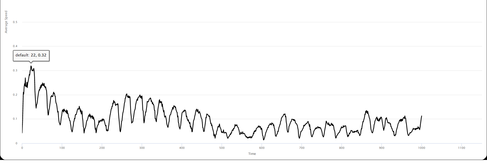

## Імітаційне моделювання комп'ютерних систем
## СПм-21-2, **Верховський Ігор Валерійович**
### Додаткове завдання №**1**. Опис імітаційних моделей

 

### Обрана модель в середовищі NetLogo:
[Traffic Grid](http://www.netlogoweb.org/launch#http://www.netlogoweb.org/assets/modelslib/Sample%20Models/Social%20Science/Traffic%20Grid.nlogo)

 

### Вербальний опис моделі:
Модель руху транспорту в міській сітці. Дозволяє вам керувати світлофорами та глобальними змінними, такими як обмеження швидкості та кількість автомобілів, а також досліджувати динаміку руху. 

### Параметри:
- **speed-limit** встановлює максимальну швидкість для автомобілів.
- **num-cars** встановлює кількість автомобілів у симуляції.
- **ticks-per-cycle** встановлює кількість тактів, які минуть для кожного цикла. Це не впливає на ручне освітлення. Це дозволяє збільшувати або зменшувати деталізацію, з якою світло може автоматично змінюватися.
- **grid-size-x** GRID-SIZE-X - встановлює кількість вертикальних доріг.
- **grid-size-y** встановлює кількість горизонтальних доріг.
- **acceleration** константа, определяющая, насколько автомобиль ускоряется или замедляется, если это ускорение или замедление.
- **phase** визначає поточну фазу.
- **speed** швидкість руху автомобілей.

### Критерії ефективності системи:
- поточна кількість зупинившихся машин.
- середня швидкість автомобіля.
- середній час очікування.

### Алгоритм роботи моделі:

Кожного кроку машини намагаються рухатися вперед із поточною швидкістю. Якщо їхня поточна швидкість менша за обмеження швидкості і прямо перед ними немає автомобіля, вони прискорюються. Якщо попереду є повільніша машина, вони зрівняються зі швидкістю повільнішої машини та сповільнюються. Якщо перед ними червоне світло або зупинилася машина, вони зупиняються.

**Кожен такт у моделі**:
- Для кожного автомобіля:
  - намагаються рухатися вперед із поточною швидкістю.
  - Якщо їхня поточна швидкість менша за обмеження швидкості і прямо перед ними немає автомобіля, вони прискорюються.
  - Якщо попереду є повільніша машина, вони зрівняються зі швидкістю повільнішої машини та сповільнюються.
  - Якщо перед ними червоне світло або зупинилася машина, вони зупиняються.
 

 

## Обчислювальні експерименти

### 1. Залежність середнього часу очикування від кількості тактів однієї фази.
Досліджуємо залежність середнього часу очикування від кількості тактів однієї фази. Експерименти проводилися з кількістю тактів однієї фази  від 20 до 100, з кроком 20, всього 5 симуляцій.

<table>
<thead>
<tr><th>Кількість тактів однієї фази</th><th>Середній час очикування</th></tr>
</thead>
<tbody>
<tr><td>20</td><td>13.01</td></tr>
<tr><td>40</td><td>32.18</td></tr>
<tr><td>60</td><td>104.82</td></tr>
<tr><td>80</td><td>316.93</td></tr>
<tr><td>100</td><td>950.30</td></tr>
</tbody>
</table>

Таблиця результатів наочно показує, що середній час очикування залежить від розміру фази. Середній час очикування 283 такти.

### 2. Залежність середньої швидкості автомобіля від минулого часу
Досліджуємо залежність середньої швидкості від минулого часу. Експерименти проводилися з фазою 30 тактів. Показники рахувались кожні 200 тактів від 0 до 1000, всього 5 симуляцій. Ліміт швидкості автомобіля 1.

<table>
<thead>
<tr><th>Час</th><th>Середня швидкість автомобіля</th><th>Доля здобувачів, що збирають їжу, на один такт</th><th>Смертність по причині вбивства</th></tr>
</thead>
<tbody>
<tr><td>200</td><td>0.1</td></tr>
<tr><td>400</td><td>0.12</td></tr>
<tr><td>600</td><td>0.06</td></tr>
<tr><td>800</td><td>0.07</td></tr>
<tr><td>1000</td><td>0.11</td></tr>
</tbody>
</table>

Залежність середньої швидкості автомобіля від минулого часу

