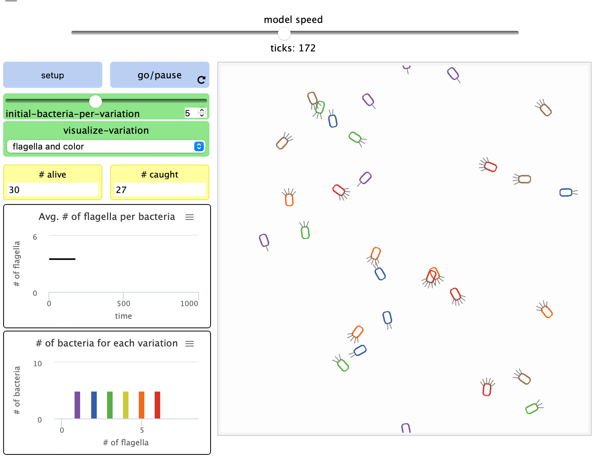

## Імітаційне моделювання комп'ютерних систем
## СПм-21-2, **Верховський Ігор Валерійович**
### Додаткове завдання №**2**. Опис імітаційних моделей

 

### Обрана модель в середовищі NetLogo:
[Bacteria Hunt Speeds](http://www.netlogoweb.org/launch#http://www.netlogoweb.org/assets/modelslib/Curricular%20Models/ModelSim/Evolution/Bacteria%20Hunt%20Speeds.nlogo)

 

### Вербальний опис моделі:
Модель природного/штучного відбору, що показує результат змагання двох конкуруючих сил натурального відбору.

### Керуючі параметри:
- **initial-bacteria-per-variation** визначає початкову кількість бактерій в кожному з шести можливих варіантів кількості джгутиків. Загальна популяція визначається множенням цього значення на 6.
- **visualize-variation** допомагає застосовувати різні "підказки" візуалізації, щоб побачити наявні варіації кожної бактерії. При значенні "джгутики та колір" на кожній бактерії зʼявиться кількість джгутиків, колір відповідатиме кількості джгутиків. Назви значень "лише колір", "лише джгутики" та "нічого" говорять самі за себе.
- **# of bacteria each variation** гістограма, що показує розподіл бактерій з різною кількістю джгутиків (що вказують на відносну швиткість руху).
- **avg. # of flagella per bacteria** двовимірний графік середньої кількості джгутиків на одну бактерію за весь час. 
- **# alive** відстежує та показує загальну кількість живих бактерій.
- **# caught** - відстежує та показує загальну кількість впійманих бактерій.

### Критерії ефективності системи:
- поточна кількість живих.
- поточна кількість впійманих.
- поточна кількість джгутиків.
- час, який змогла протриматися популяція.

### Алгоритм роботи моделі:

Користувач бере на себе роль хижака на одноклітинних бактерій. Створені за заданими параметрами бактерії випадковим чином розподіляються по всьому ігровому полі. Після початку гри, бактерії починають рухатися зі швидкістю, пропорційною кількості їх джгутиків. Ціль ігрока - впіймати якомога більше бактерій, клікаючи на них.
Спочатку існує однакова кількість кожної субпопуляції бактерій. З кожною новою впійманою бактерією їх розподіл має тенденцію змінюватися, як показано на гістограмі # of bacteria each variation.

- Процедура розмноження:
  - шість різних варіацій популяції спочатку рівномірно розподілені між шістьма субпопуляціями бактерій. З кожною бактерією, яку ви ловите, нова бактерія випадковим чином вибирається з популяції, щоб створити одне потомство. Кількість джгутиків – спадкова ознака. Таким чином, обране потомство є точним дублікатом батька (за кількістю джгутиків, а також за розташуванням у світі). Створення нового потомства підтримує загальну популяцію бактерій постійною.

Bacteria Hunt Speeds

### Примітки:
- avg. # of flagella per bacteria має тенденцію до збільшення, коли бактерію переслідую миша гравця, та навпаки.
- деякі варіації результатів пояснюються випадковим розподілом бактерій.
- бактерії можуть виявити хижака лише в своєму конусі зору (120 градусів), тому не реагуватимуть на курсор миші, коли їх спіймають або поженуться ззаду. 

### Недоліки моделі:
- стійке відхилення результатів від середнього значення через випадковий розподіл бактерій та інше.
