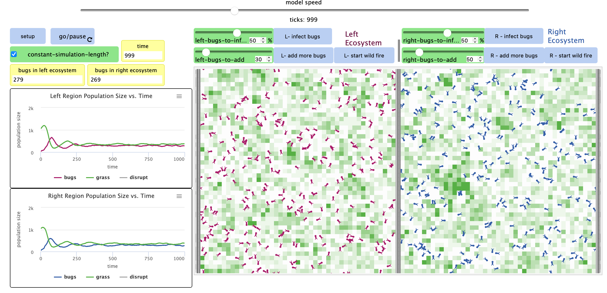
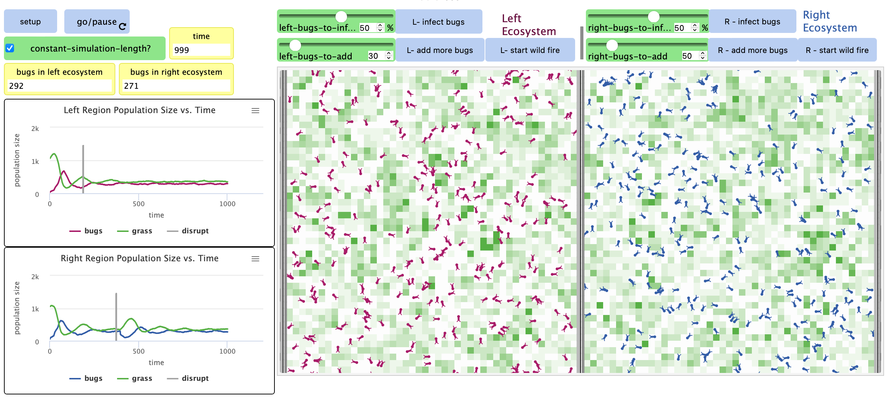

## Імітаційне моделювання комп'ютерних систем
## СПм-21-2, **Верховський Ігор Валерійович**
### Додаткове завдання №**3**. Опис імітаційних моделей

 

### Обрана модель в середовищі NetLogo:
[Bug Hunt Disruptions](http://www.netlogoweb.org/launch#http://www.netlogoweb.org/assets/modelslib/Curricular%20Models/ModelSim/Population%20Biology/Bug%20Hunt%20Disruptions.nlogo)

 

### Вербальний опис моделі:
Модель досліджує стабільність екосистем споживачів-виробників у відповідь на тимчасові заворушення.

### Керуючі параметри:
- **CONSTANT-SIMULATION-LENGTH** коли увімкнено, прогон моделі автоматично завершиться на 1000 тіку. Інакше працюватиме до зупинки вручну.
- **LEFT-BUGS-TO-ADD / RIGHT-BUGS-TO-ADD** визначає початковий розмір популяції жуків в регіоні, також визначає кількість жуків,що буде додано до запуску моделі після натискання "L-ADD-MORE-BUGS" або "R-ADD-MORE-BUGS".
- **LEFT-BUGS-TO-INFECT / RIGHT-BUGS-TO-INFECT** визначає відсоток популяції в регіоні, який буде "заражений". Хвороба передається іншим жукам при контакті. Після певного часу, хворі жуки гинуть.
- **L-START WILD FIRE / R-START WILD FIRE** починає "пожежу" в одному з регіонів. Вогонь передається від палаючих ділянок тим, на яких є трава.

### Критерії ефективності системи:
- поточна смертність по причині спраги.
- поточна смертність по причині голоду.
- поточна кількість джгутиків.
- середній розмір популяції.
- час, який змогла протриматися популяція.
- розподіл ресурсів.

### Алгоритм роботи моделі:

Жуки випадково блукають по одному з двох регіонів (ліворуч або праворуч). Кожен регіон є самодостатньою екосистемою. Жуки з одного регіону ніколи не потрапляють в інший. Коли жуки досягають краю свого регіону, вони переходять на іншу сторону свого регіону.
У цій системі можна перевірити різні перешкоди, зокрема тимчасове видалення трави (імітація пожежі), додавання додаткових жуків та зараження деякого % жуків (імітація переданої хвороби).

- Процедура розмноження:
  - кожен крок кожен жук втрачає одну одиницю енергії, вони повинні споживати їжу (траву), щоб відновити енергію. Коли в них закінчується енергія, вони гинуть. Щоб популяція продовжувалася, кожен жучок повинен мати достатньо енергії, щоб мати потомство. Коли цей поріг досягається, нащадок і батько ділять енергію між собою.

### Примітки:
- популяція жуків залежить від доступності їжі.
- додавання жуків чи виклик хвороб впливає на численність популяції лише в короткостроковій перспективі.

Популяції без зовнішнього впливу

Популяції під впливом пожежі та хвороби

