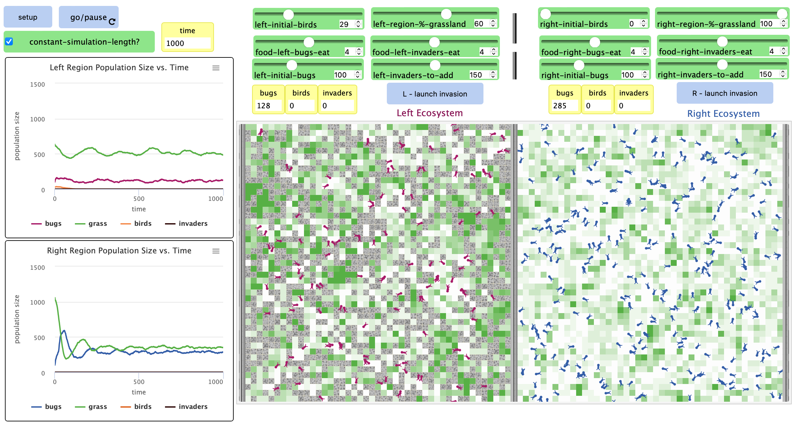
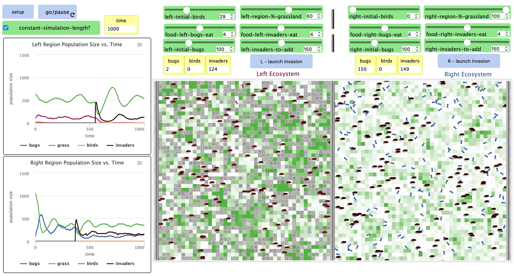

## Імітаційне моделювання комп'ютерних систем
## СПм-21-2, **Верховський Ігор Валерійович**
### Додаткове завдання №**5**. Опис імітаційних моделей

 

### Обрана модель в середовищі NetLogo:
[Bug Hunt Predators and Invasive Species - Two Regions](http://www.netlogoweb.org/launch#http://www.netlogoweb.org/assets/modelslib/Curricular%20Models/ModelSim/Population%20Biology/Bug%20Hunt%20Predators%20and%20Invasive%20Species%20-%20Two%20Regions.nlogo)

 

### Вербальний опис моделі:
Модель досліджує стабільність екосистем споживачів-виробників, коли різні початкові популяції хижаків і травоїдних ініціалізуються в моделі та коли до моделі додається різна кількість інвазивних видів.

### Керуючі параметри:
- **CONSTANT-SIMULATION-LENGTH** коли увімкнено, прогон моделі автоматично завершиться на 1000 тіку. Інакше працюватиме до зупинки вручну.
- **LEFT-INITIAL-BIRDS / RIGHT-INITIAL-BIRDS** визначає численність початкової популяції птахів в регіоні.
- **LEFT-REGION-%-OF-GRASSLAND / RIGHT-REGION-%-OF-GRASSLAND** визначає відсоток регіону, що буде вкритий травою.
- **FOOD-LEFT-BUGS-EAT / FOOD-RIGHT-BUGS-EAT** визначає кількість енергії, яку отримують жуки певного регіону, зʼїдаючи траву.
- **LEFT-INITIAL-BUGS / RIGHT-INITIAL-BUGS** визначає численність початкової популяції жуків.
- **FOOD-LEFT-INVADERS-EAT / FOOD-RIGHT-INVADERS-EAT** задає кількість енергії, яку отримуватимуть інвазивні види, поїдаючи траву.
- **LEFT-BUGS-TO-INFECT / RIGHT-BUGS-TO-INFECT** визначає відсоток популяції в регіоні, який буде "заражений". Хвороба передається іншим жукам при контакті. Після певного часу, хворі жуки гинуть.
- **LEFT-INVADERS-TO-ADD / RIGHT-INVADERS-TO-ADD** визначає чисельність інвазивних видів, що будуть додані до регіону натисканням LAUNCH INVASION.

### Критерії ефективності системи:
- поточна кількість живих жуків.
- середній розмір популяції.
- розподіл ресурсів.

### Алгоритм роботи моделі:

Жуки випадково блукають по одному з двох регіонів (ліворуч або праворуч). Кожен регіон є самодостатньою екосистемою. Жуки з одного регіону ніколи не потрапляють в інший. Коли жуки досягають краю свого регіону, вони переходять на іншу сторону свого регіону.
Для кожного регіону можна призначити різну кількість пасовищ. У межах кожного регіону ці луки будуть поростати травою з фіксованою швидкістю, коли її з’їдять. Траву їдять, коли жук пересувається по цій ділянці. Коли це відбувається, фіксована кількість енергії трави вираховується з ділянки (квадрата), де трава була з’їдена.
Птахи безладно блукають по одному з двох регіонів (ліворуч або праворуч), дотримуючись подібних правил руху, втрати енергії та розмноження, що й жуки. Птахи їдять жуків, а не траву.
Інвазивний вид може бути введений в будь-яку екосистему моделі. Особи інвазивних видів безладно блукають регіонами. Правила їх руху, втрати енергії та розмноження такі ж, як і у жуків. Вони також їдять траву.

- Процедура розмноження:
  - кожен крок кожен жук втрачає одну одиницю енергії, вони повинні споживати їжу (траву), щоб відновити енергію. Коли в них закінчується енергія, вони гинуть. Щоб популяція продовжувалася, кожен жучок повинен мати достатньо енергії, щоб мати потомство. Коли цей поріг досягається, нащадок і батько ділять енергію між собою.

### Примітки:
- усі популяції прямо чи опосередковано залежать від кількості доступної трави.
- додавання жуків чи виклик хвороб впливає на численність популяції лише в короткостроковій перспективі.
- кількість доступної їжі напряму впливає на численність популяції в довгостроковій перспективі.

Популяції без впливу інвазивних видів

Популяції під впливом інвазивних видів

