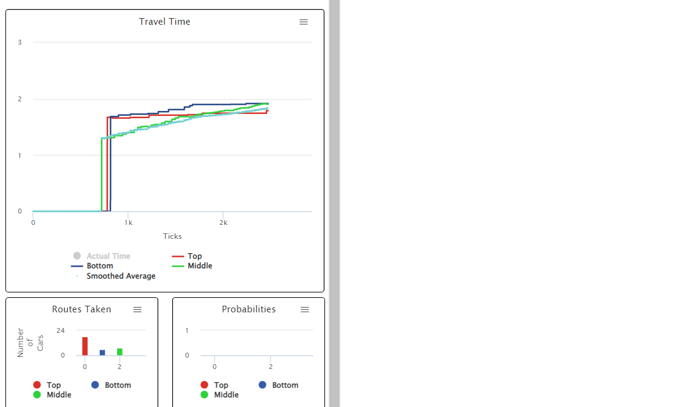

## Імітаційне моделювання комп'ютерних систем
## СПм-21-2, **Верховський Ігор Валерійович**
### Додаткове завдання №**6**. Опис імітаційних моделей

 

### Обрана модель в середовищі NetLogo:
[Braess Paradox](http://www.netlogoweb.org/launch#http://www.netlogoweb.org/assets/modelslib/Sample%20Models/Social%20Science/Economics/Braess%20Paradox.nlogo)

 

### Вербальний опис моделі:
Модель на основі агентів, призначена для демонстрації явища з теорії ігор (підгалузь економіки), яке називається парадоксом Браесса. Парадоксальний аспект парадоксу Браесса виникає, коли до транспортної мережі додається додатковий маршрут, який дозволяє дуже швидкий транзит. Коли це буде зроблено, схему руху можна змінити на таку, яка матиме гірші індивідуальні та глобальні результати (час у дорозі). Коротше кажучи, ми можемо відкрити більше доріг і фактично погіршити рух. (Braess та ін., 2005)

Парадокс Браесса — це суперечливий результат, який виникає під час аналізу конкретних графіків через призму теорії ігор. Ці графіки зазвичай сприймаються як представлення мереж трафіку, але парадокс Браесса насправді є широкомасштабним явищем, яке можна застосовувати в багатьох контекстах за межами мереж трафіку. Проте для простоти ми будемо інтерпретувати та представляти ці графіки лише як мережі трафіку в цій моделі. Маючи графік конкретної мережі трафіку, ми можемо визначити стабільний набір стратегій (маршрутів для пересування з однієї точки в іншу), які агенти (у цьому випадку автономні пасажири) віддадуть перевагу прийняттю над усіма іншими стратегіями. Це називається рівновагою Неша. Стратегії, прийняті пасажирами в рівновазі Неша, приведуть до результатів для пасажирів.ж досліджувати динаміку руху. 

### Параметри:
- **spawn-rate** визначає, як часто нові транспортні засоби з’являються на початковому вузлі(не впливає на час подорожі)
- **smoothing** Цей параметр додано, щоб водії могли змусити брати до уваги інформацію не лише про попереднього водія для проходження заданого маршруту
- **mode** вибирає алгоритми та евристики, описані вище, щоб визначити, який маршрут обирають транспортні засоби.
- **travel-time** Час подорожі до завершення маршруту.
- **delay** час перед початком руху нового водія.

### Критерії ефективності системи:
- час подорожу.
- популярнысть маршруту .
- середній час очикування.

### Алгоритм роботи моделі:

Водії в цій моделі виникають у початковому вузлі транспортної мережі у верхньому лівому куті. Водії представлені графічно як автомобіль або вантажівка, але це лише для візуального ефекту. Усі Водії дотримуються однакових правил поведінки. Певна евристика використовується водіями для визначення шляху, яким вони пройдуть через мережу, перш ніж вона почне свою подорож через сітку трафіку. Потім водій рухається, по одному квадрату дороги (патч) за раз, і залишається на цьому ділянці певну кількість тактів, перш ніж перейти до наступного. Коли водій досягає кінцевого вузла, він повідомляє шлях, який він пройшов через мережу, а також загальну кількість тиків, витрачених на транзит. Ця інформація зберігається моделлю та використовується для створення «звіту про дорожній рух».

Певні ділянки цієї моделі вибрано для зображення доріг. Існує два типи дорожніх ділянок: дороги зі статичною вартістю та дороги з динамічною вартістю. Дороги зі статичною вартістю вимагають, щоб автомобіль залишався на цій ділянці протягом фіксованого часу, перш ніж рухатися далі. Дороги з динамічними витратами вимагають, щоб автомобіль залишався на цій ділянці протягом певного часу, який залежить від кількості кліків з моменту, коли остання черепаха зайняла цю ділянку, таким чином імітуючи затори. У моделі також є перемикач, який дозволяє відкривати або закривати середній шлях дороги з майже нульовою ціною. Як згадувалося вище, коли водії досягають кінця мережі руху, вони повідомляють свій вибір маршруту та витрачений час у тиках.

Існує три можливі маршрути, а звіти про час беруться та використовуються для визначення трьох глобальних змінних, що відповідають кожному маршруту. Їх можна розглядати як звіти про дорожній рух. Потім ця інформація використовується майбутніми пасажирами при виборі маршруту. Те, як ця інформація використовується водіями, залежить від активної евристики або алгоритму.

### Евристика:

Далі наведено описи різних режимів, за допомогою яких пасажири в моделі визначатимуть маршрут, яким вони рухатимуться через мережу руху. Ці режими можна встановити перед запуском моделі, але їх також можна змінити під час виконання моделі.

- Найбільш відомий із випадковим відхиленням: коли цей режим активний, автомобілі вибиратимуть маршрут із найменшим поточним середнім часом або відхилятимуться до випадкового маршруту з певною ймовірністю, визначеною значенням параметра ймовірності в моделі, поділеним на сто.
- Емпіричний аналітичний: у цьому режимі автомобілі знають поточну кількість автомобілів на дорозі та маршрути, якими вони рухаються. Вони використовують цю інформацію, щоб аналітично обчислити, яким маршрутом для них буде найкраще йти, а потім обирають цей маршрут.
- Probabilistic Greedy: у цьому режимі пасажири вибиратимуть маршрути з імовірністю, пропорційною продуктивності даного маршруту. Тут параметр випадковості використовується для визначення того, наскільки ймовірність розподіляється між кращими маршрутами. Налаштування випадковості нуль не зробить жоден маршрут більш вірогідним, ніж будь-який інший, незалежно від ефективності маршруту. Налаштування випадковості, що дорівнює 100, зробить надзвичайно ймовірним те, що автомобілі рухатимуться лише поточним найкращим маршрутом.
 

 

## Обчислювальні експерименти

### 1. Залежність кращого маршруту від режиму виконання моделі.
Досліджуємо залежність кращого маршруту від режиму виконання моделі. Експерименти проводилися з spawn-rate 10, smoothing 5 та randomless 33.

<table>
	<thead>
		<tr>
			<th></th>
			<th>Найбільш відомий із випадковим відхиленням</th>
			<th>Емпіричний аналітичний</th>
			<th>Probabilistic Greedy</th>
		</tr>
	</thead>
	<tbody>
		<tr>
			<td>Маршрут</td>
			<td>Top line</td>
			<td>Middle line</td>
			<td>Cell 4x1</td>
		</tr>
	</tbody>
</table>

Найбільш відомий із випадковим відхиленням

Емпіричний аналітичний

Probabilistic Greedy

