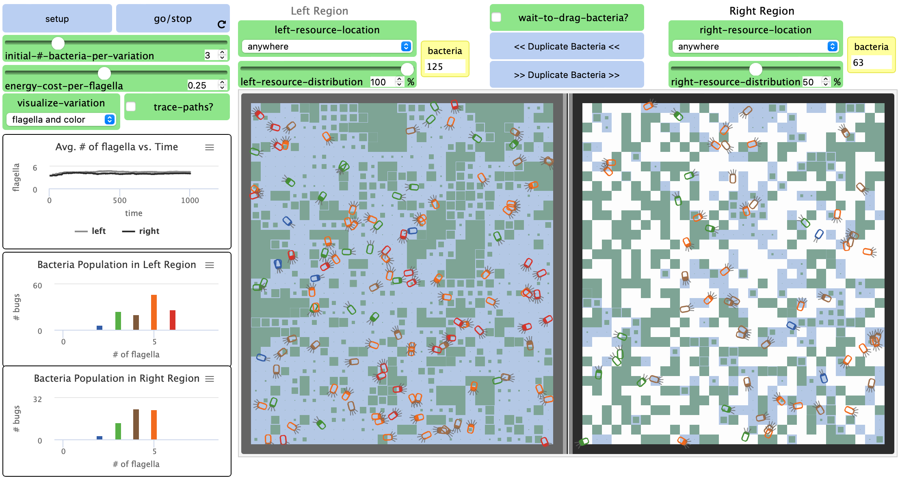

## Імітаційне моделювання комп'ютерних систем
## СПм-21-2, **Верховський Ігор Валерійович**
### Лабораторна робота №**1**. Опис імітаційних моделей

 

### Обрана модель в середовищі NetLogo:
[Bacteria Food Hunt](http://www.netlogoweb.org/launch#http://www.netlogoweb.org/assets/modelslib/Curricular%20Models/ModelSim/Evolution/Bacteria%20Food%20Hunt.nlogo)

 

### Вербальний опис моделі:
Модель природного/штучного відбору, що показує, як урівноважені сили природного відбору абіотичного і біотичного середовищ та розподілу ресурсів, необхідних для виживання, впливають на результати відбору. Модельованою популяцією є одноклітинними бактеріями. На результат впливає розподіл ресурсів (їжа, вода, тощо).

### Керуючі параметри:
- **energy-cost-per-flagella** визначає кількість енергії, що витрачається на кожний джгутик за кожну одиницю часу. Так бактерія з шістьма джгутиками втрачатиме х6 від цього значення. Віднімається на основі втрат енергії метаболізму для всіх бактерій на кожному кроці.
- **initial-#-bacteria-per-variation** визначає початкову кількість бактерій в кожному з шести можливих варіантів кількості джгутиків. Загальна популяція визначається множенням цього значення на 6.
- **visualize-variation** допомагає застосовувати різні "підказки" візуалізації, щоб побачити наявні варіації кожної бактерії. При значенні "джгутики та колір" на кожній бактерії зʼявиться кількість джгутиків, колір відповідатиме кількості джгутиків. Назви значень "лише колір", "лише джгутики" та "нічого" говорять самі за себе.
- **trace-paths?** інструмент візуалізації, що показує шлях руху кожної бактерії. Може бути корисно для визначення, чи мають різні варіації бактерій різні "вподобання" щодо маршрутів або де часто вмирають через брак їжі.
- **avg. # of flagella vs. time** показує як середня кількість джгутиків в кожному регіоні змінюється з часом (значення від 1 до 6).
- **bacteria in left region** є гістограмою, що показує розподіл бактерій з різною кількістю джгутиків у лівій області. Кольори відповідають кількості джгутиків від більшого до меншого: червоний, помаранчевий, жовтий, зелений, синій та фіолетовий.
- **bacteria in right region** - аналогічна попередній гістограма для правої області.
- **LEFT-RESOURCE-LOCATION** описує форму розподілу води в середовищі. Поряд з водою також можуть рости водорості (їжа). Ефекти цього значення працюватимуть разом з LEFT-RESOURCE-DISTRIBUTION. Наприклад: коли для пріоритету встановлено значення "будь-де", випадкова кількість місць (визначена % в LEFT-RESOURCE-DISTRIBUTION) заповниться водою. Якщо встановлено "навколо центральної точки", значення % визначає відносний розмір кола відносно усього середовища розміщення води. Значення "горизонтальна смуга", "вертикальна см. зліва" або "верт. см. зправа", значення % визначає відносну ширину смуги порівняно з усім середовищем. Відповідно RIGHT-RESOURCE-LOCATION та RIGHT-RESOURCE-DISTRIBUTION визначають налаштування правого середовища.
- **WAIT-TO-DRAG?** дозволяє користувачеві переміщувати та обертати бактерію курсором миші коли встановлено значення "увімкнено". Якщо "увімкнено" і натиснуто GO/STOP, користувач може перетягнути бактерію в будь-яке місце. Перетягнення бактерії за  межі області призведе до її загибелі. Якщо клікнути та утримувати кнопку кнопку миші над бактерією, не пересуваючи курсор, курсор змінюватиме кольори, вказуючи на підготування до зміни орієнтації бактерії: через кілька секунд вона почне обертатися за годинниковою стрілкою, доки кнопка миші не буде відпущена.
- **DUPLICATE BACTERIA >>** видаляє всі існуючі бактерії з правої області, потім робить копію кожної бактерії з лівої області в праву. Аналогічна функція існує зворотнього напрямку.

### Критерії ефективності системи:
- поточна смертність по причині спраги.
- поточна смертність по причині голоду.
- поточна кількість джгутиків.
- середній розмір популяції.
- час, який змогла протриматися популяція.
- розподіл ресурсів.

### Алгоритм роботи моделі:

Базовий метаболізм визначає кількість енергії, що віднімається за одиницю часу для кожної окремої бактерії. ENERGY COST PER FLAGELLA визначає витрати енергії за одиницю часу на кожен джгутик - це плата за підвищену кількість кінетичної енергії, необхідної для більш швидкого руху за допомогою більшої кількості джгутиків. У цій моделі витрата енергії є лінійною функцією швидкості руху. Більше джгутиків - швидше рух - більше споживання енергії.
Подорожуючи ділянками з водоростями, бактерії поглинають частину водоростей. Коли всю їжу, вироблену водоростями на цій ділянці, буде зʼїдено, знадобиться час для її відновлення. Лише ділянки з водою відростатимуть.

- Процедура розмноження:
  - поїдаючи водорості, бактерії отримують енергію, що відображається візуально. Досягнувши максимального рівня енергії, вони можуть безстатево розмножуватись, розділяючи енергію навпіл між батьками та потомством. Якщо рівень енергії бактерії сягне нуля - вона загине.

### Примітки:
- гістограма для бактерій у кожній області має тенденцію зміщуватися праворуч з одними комбінаціями умов середовища та ліворуч з іншими, іноді зсуваючись до значення середнього діапазону.
- деякі варіації результатів пояснюються випадковим розподілом бактерій у кожному регіоні. Цей ефект можна усунути за допомогою функції "DUPLICATE BACTERIA".
- напрямок еволюції в регіоні може спочатку мати один напрямок та змінити його по мірі проходження циклу. Часто це пояснюється зміною умов навколишнього середовища внаслідок діяльності бактерій. 

### Недоліки моделі:
- стійке відхилення результатів від середнього значення через випадковий розподіл бактерій на початку моделювання.

 

## Обчислювальні експерименти

### 1. Початкова доступність води визначає розмір популяції.
Досліджуємо залежність середнього розміру популяції від початкової доступності води, в умовах коли параметри симуляції дозволяють популяції виживати середньо довго (1000 тактів). Експерименти проводилися з початковою доступністю води від 25% до 100%, з кроком 25, всього 4 симуляції.
Параметри системи, при яких здійснювалась симуляція:
- **initial-#-bacteria-per-variation**: 3
- **energy-cost-per-flagella**: 0.25
- **left-resource-location**: anywhere
- **right-resource-location**: anywhere
- **left-resource-distribution**: 100 / 75
- **right-resource-distribution**: 50 / 25

<table>
<thead>
<tr><th>Доступність води</th><th>Середній розмір популяції</th></tr>
</thead>
<tbody>
<tr><td>0</td><td>0</td></tr>
<tr><td>25</td><td>33</td></tr>
<tr><td>50</td><td>63</td></tr>
<tr><td>75</td><td>95</td></tr>
<tr><td>100</td><td>125</td></tr>
</tbody>
</table>

Залежність середнього розміру популяції від початкової доступності води

Рисунок наочно показує, що середній розмір популяції напряму залежить від початкової кількості плодових кущів. Середній розмір популяції на одиницю длступності води становить 1.25:1.

